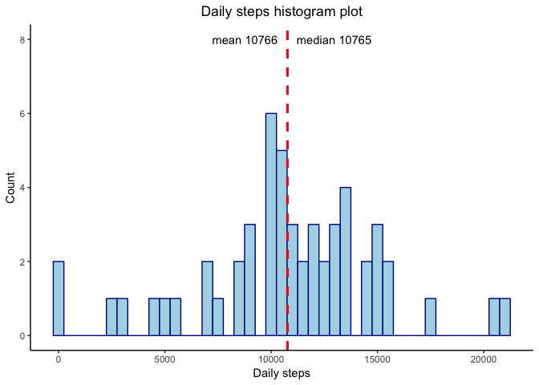
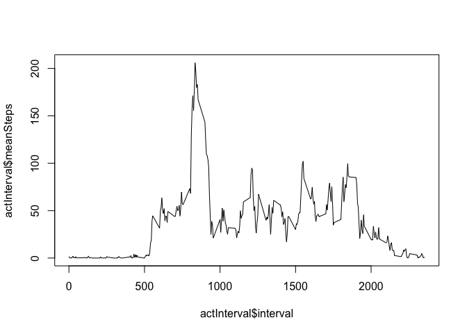
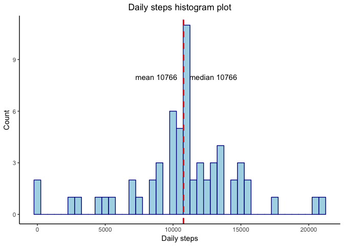
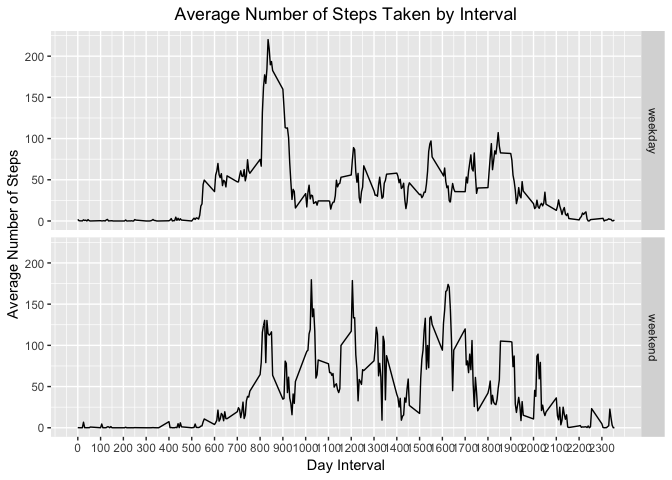

## Loading and preprocessing the data
Load the data. Date data format will be changed from charactor to date.

```r
activity <- read.csv("activity.csv", stringsAsFactors = FALSE)
activity$date <- as.Date(activity$date)
print(head(activity))
```

```
##   steps       date interval
## 1    NA 2012-10-01        0
## 2    NA 2012-10-01        5
## 3    NA 2012-10-01       10
## 4    NA 2012-10-01       15
## 5    NA 2012-10-01       20
## 6    NA 2012-10-01       25
```


## What is mean total number of steps taken per day?
For this part of the assignment, we will ignore the missing values in the dataset.

```r
library(dplyr)
```

```
## 
## Attaching package: 'dplyr'
```

```
## The following objects are masked from 'package:stats':
## 
##     filter, lag
```

```
## The following objects are masked from 'package:base':
## 
##     intersect, setdiff, setequal, union
```

```r
activity_per_day <- activity %>%
    group_by(date) %>% summarise(step_per_day = sum(steps, na.rm = FALSE))
print(head(activity_per_day))
```

```
## # A tibble: 6 x 2
##   date       step_per_day
##   <date>            <int>
## 1 2012-10-01           NA
## 2 2012-10-02          126
## 3 2012-10-03        11352
## 4 2012-10-04        12116
## 5 2012-10-05        13294
## 6 2012-10-06        15420
```

```r
library(ggplot2)
p <- ggplot(activity_per_day, aes(x=step_per_day)) +
    geom_histogram(binwidth=500, fill="lightblue", color="darkblue") +
    labs(title="Daily steps histogram plot",x="Daily steps", y = "Count") +
    theme_classic() + theme(plot.title = element_text(hjust = 0.5)) +
    geom_vline(aes(xintercept=mean(step_per_day, na.rm = TRUE)),
            color="blue", linetype="dashed", size=1) +
    annotate("text", x=mean(activity_per_day$step_per_day, na.rm = TRUE)-2000, y=8,
             label=paste("mean",as.integer(mean(activity_per_day$step_per_day, na.rm = TRUE)))) +
    geom_vline(aes(xintercept=median(step_per_day, na.rm = TRUE)),
            color="red", linetype="dashed", size=1) +
    annotate("text", x=median(activity_per_day$step_per_day, na.rm = TRUE)+2200, y=8,
             label=paste("median",as.integer(median(activity_per_day$step_per_day,
                                                    na.rm = TRUE))))
p
```

```
## Warning: Removed 8 rows containing non-finite values (stat_bin).
```

<!-- -->

Mean and median value is very similer, however, NA data is ignored.

## What is the average daily activity pattern?
Make a time series plot (i.e. \color{red}{\verb|type = "l"|}type="l") of the 5-minute interval (x-axis) and the average number of steps taken, averaged across all days (y-axis)


```r
actInterval <- activity %>% group_by(interval) %>% summarise(meanSteps = mean(steps, 
    na.rm = TRUE))
plot(actInterval$interval, actInterval$meanSteps, type="l")
```

<!-- -->

Which 5-minute interval, on average across all the days in the dataset, contains the maximum number of steps?
- Around 800 interval has max number of steps.

## Imputing missing values

Note that there are a number of days/intervals where there are missing values (coded as \color{red}{\verb|NA|}NA). The presence of missing days may introduce bias into some calculations or summaries of the data.

Calculate and report the total number of missing values in the dataset (i.e. the total number of rows with \color{red}{\verb|NA|}NAs)


```r
sum(is.na(activity$steps))
```

```
## [1] 2304
```

```r
2304/nrow(activity)
```

```
## [1] 0.1311475
```
About 13% data are missing in the dataset.

Missing data is imputed with mean for that 5-minute interval.


```r
activity2 <- activity %>% left_join(actInterval, by = "interval")
activity2$fillSteps <- ifelse(is.na(activity2$steps), activity2$meanSteps, activity2$steps)
activity2$steps <- NULL
activity2$meanSteps <- NULL
colnames(activity2) <- c("date", "interval", "steps")

activity2 <- activity2[, c(3, 1, 2)]
head(activity2)
```

```
##       steps       date interval
## 1 1.7169811 2012-10-01        0
## 2 0.3396226 2012-10-01        5
## 3 0.1320755 2012-10-01       10
## 4 0.1509434 2012-10-01       15
## 5 0.0754717 2012-10-01       20
## 6 2.0943396 2012-10-01       25
```


```r
activity2_per_day <- activity2 %>%
    group_by(date) %>% summarise(step_per_day = sum(steps, na.rm = TRUE))

print(head(activity2_per_day))
```

```
## # A tibble: 6 x 2
##   date       step_per_day
##   <date>            <dbl>
## 1 2012-10-01       10766.
## 2 2012-10-02         126 
## 3 2012-10-03       11352 
## 4 2012-10-04       12116 
## 5 2012-10-05       13294 
## 6 2012-10-06       15420
```

```r
p2 <- ggplot(activity2_per_day, aes(x=step_per_day)) +
    geom_histogram(binwidth=500, fill="lightblue", color="darkblue") +
    labs(title="Daily steps histogram plot",x="Daily steps", y = "Count") +
    theme_classic() + theme(plot.title = element_text(hjust = 0.5)) +
    geom_vline(aes(xintercept=mean(step_per_day)),
            color="blue", linetype="dashed", size=1) +
    annotate("text", x=mean(activity2_per_day$step_per_day)-2000, y=8,
             label=paste("mean",as.integer(mean(activity2_per_day$step_per_day)))) +
    geom_vline(aes(xintercept=median(step_per_day)),
            color="red", linetype="dashed", size=1) +
    annotate("text", x=median(activity2_per_day$step_per_day)+2200, y=8,
             label=paste("median",as.integer(median(activity2_per_day$step_per_day))))
p2
```

<!-- -->


## Are there differences in activity patterns between weekdays and weekends?


```r
activity2$dayType <- ifelse(weekdays(activity2$date) %in% c("Satuday", "Sunday"), 
    "weekend", "weekday")

head(activity2)
```

```
##       steps       date interval dayType
## 1 1.7169811 2012-10-01        0 weekday
## 2 0.3396226 2012-10-01        5 weekday
## 3 0.1320755 2012-10-01       10 weekday
## 4 0.1509434 2012-10-01       15 weekday
## 5 0.0754717 2012-10-01       20 weekday
## 6 2.0943396 2012-10-01       25 weekday
```


```r
actInterval2 <- activity2 %>%
    group_by(interval, dayType) %>%
    summarise(meanSteps = mean(steps, na.rm = TRUE))

p3 <- ggplot(data = actInterval2, aes(x = interval, y = meanSteps)) + 
    geom_line() + facet_grid(dayType ~ .) + scale_x_continuous("Day Interval", 
    breaks = seq(min(actInterval2$interval), max(actInterval2$interval), 100)) + 
    scale_y_continuous("Average Number of Steps") +
    ggtitle("Average Number of Steps Taken by Interval") +
    theme(plot.title = element_text(hjust = 0.5))
p3
```

<!-- -->
